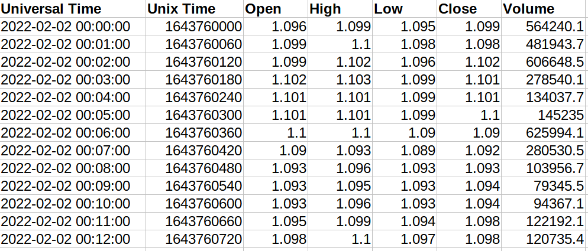
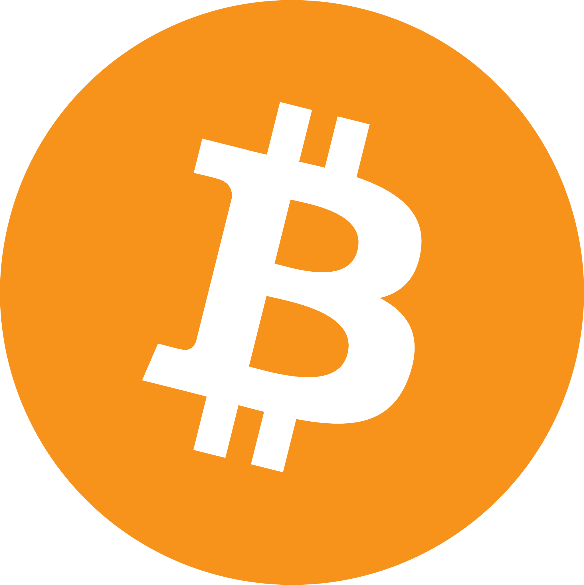
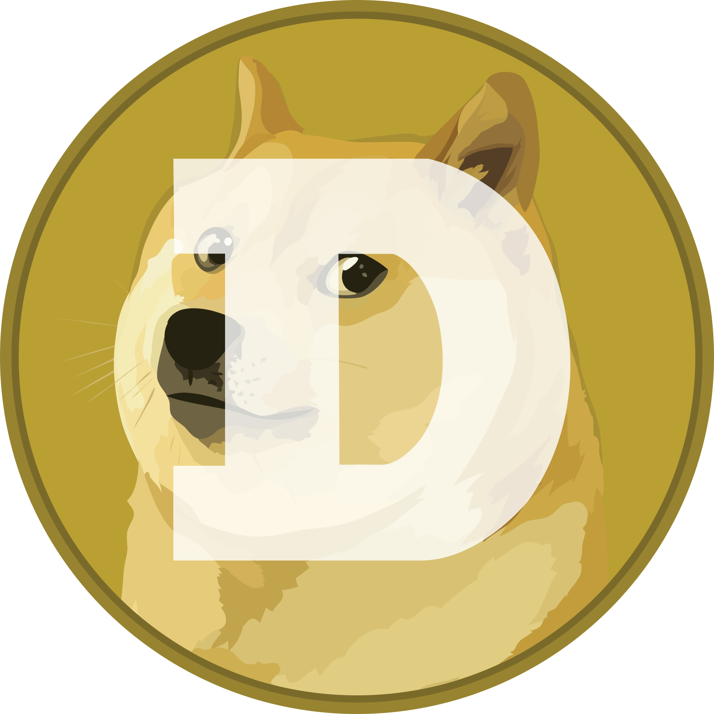

# Historic Binance OHLC Candle Data for Crypto Currency

This is a collection of the complete Binance crypto price history of selected coins. It can be helpful for backtesting and training purposes of trading robots and algorithms.

## Features

The history is available in the smallest possible 1-minute interval and is stored in .csv format. There is a separate file for each day including:

- Time stamp as
  [Universal Time (UTC)](https://en.wikipedia.org/wiki/Coordinated_Universal_Time) and
  [Unix time](https://en.wikipedia.org/wiki/Unix_time)
- historic OHLC candle data including Open, High, Low, Close
- Volume

  

## Available Coins

|     | Coin | Symbol |
|:---:|------|--------|
|         | Cardano       | ADA-USDT   |
|       | Algorand      | ALGO-USDT  |
|         | Cosmos        | ATOM-USDT  |
|      | Avalanche     | AVAX-USDT  |
|    | Bitcoin Cash  | BCH-USDT   |
|             | BNB           | BNB-USDT   |
|         | Bitcoin       | BTC-USDT   |
|       | Dogecoin      | DOGE-USDT  |
|    | Polkadot      | DOT-USDT   |
|             | EOS           | EOS-USDT   |
|        | Ethereum      | ETH-USDT   |
|      | Chainlink     | LINK-USDT  |
|        | Litecoin      | LTC-USDT   |
|       | Polygon       | MATIC-USDT |
|  | NEAR Protocol | NEAR-USDT  |
|      | Shiba Inu     | SHIB-USDT  |
|          | Solana        | SOL-USDT   |
|            | TRON          | TRX-USDT   |
|         | Uniswap       | UNI-USDT   |
|         | Stellar       | XLM-USDT   |
|          | Monero        | XMR-USDT   |
|             | XRP           | XRP-USDT   |

## Feedback and Get in Touch

TradeMonkey.io@proton.me
